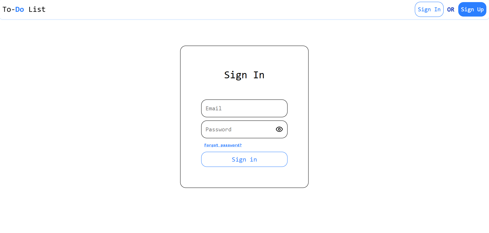
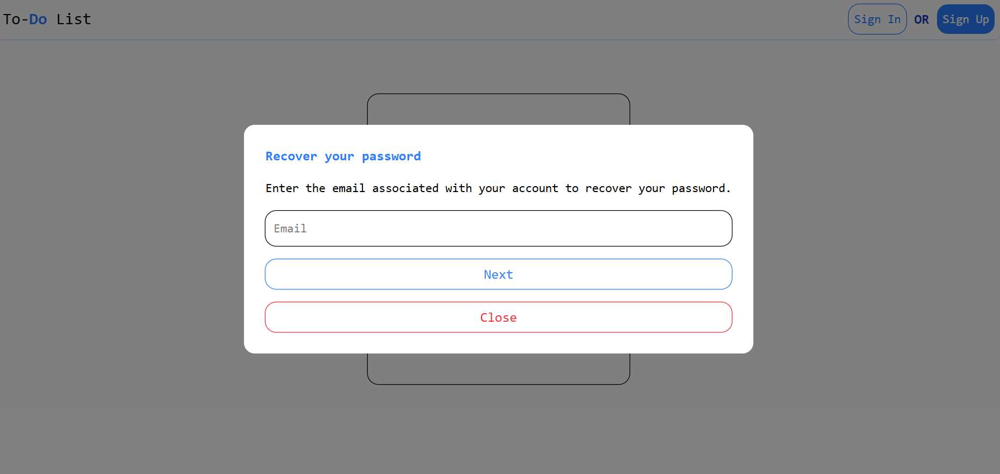
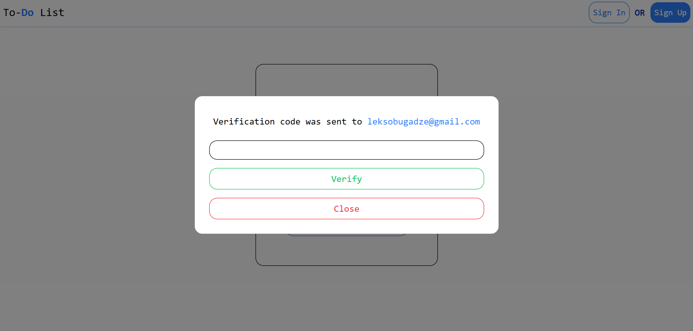
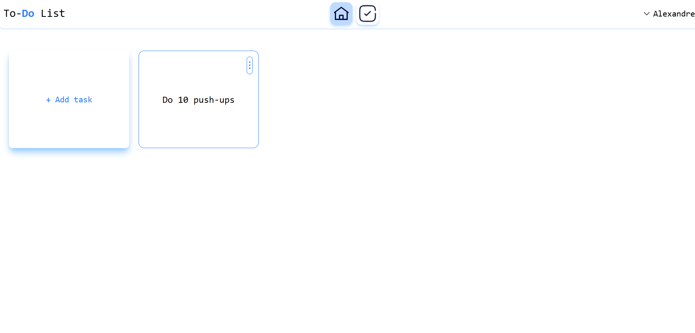
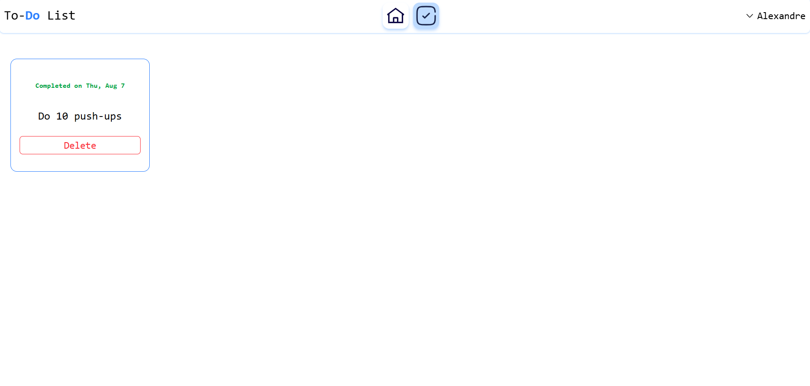
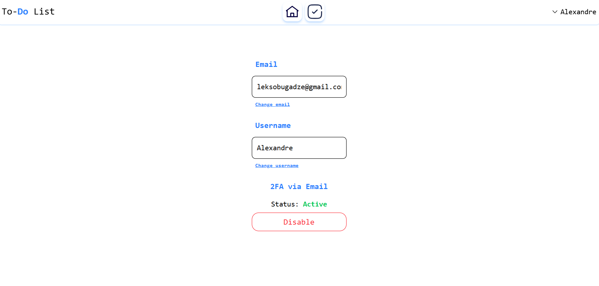

# To-Do List App

This is a simple yet secure To-Do list application which u can check out [here](https://to-do-list.aleksandrebugadze.com).

## Authentication

- Backend-controlled authentication system
- Password hashing using `bcrypt`
- Two-Factor Authentication (2FA)
- Email verification via [Resend](https://resend.com)


## Functionality

- Add new tasks
- Move tasks to the "Completed" list
- Edit existing tasks
- Delete tasks
- Change email
- Change username

## Stack

- React
- TailwindCSS
- NodeJS
- ExpressJS
- MongoDB


## For local hosting

### Clone the repository

```bash
git clone --recursive https://github.com/LeksoBugadze/To-Do-List.git
```

### Change links in fetch functions to your localhost link 

### Run Front-end

```bash
cd todoList
npm run dev
```
### Add .env file to server directory that will contain [Resend](https://resend.com) Api key and MongoDB Atlas link or local db link

```bash
API_KEY = Your resend api key
MONGODB_URL = Your DB link
```


### Run Back-end

```bash
cd todoList
cd server
npm run dev
```

# Screenshots 






